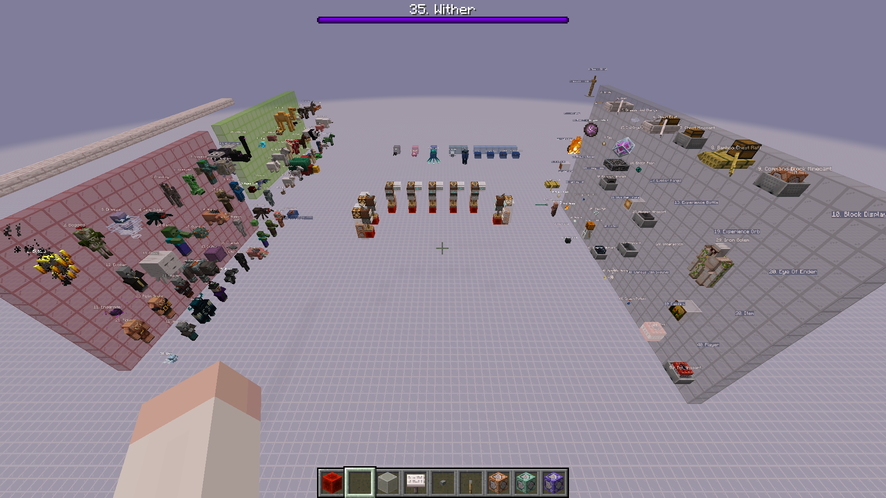

# Mobcap Test Datapack

Ad-hoc datapack to test mobcap in the Java edition of Minecraft.

## Usage

* Call `genie:summon_<spawn group>` function to spawn all mobs that contribute to the given spawn group.
* Call `genie:clear_<spawn group>` to clear the mobs from the corresponding summon command.

[WIP] But recommended using this [world download]()(WIP) with all the commands and test setups already prepared.

### Example World Download

* Toggle for each spawn group

## Overview

### Mobcaps

| F3 | Group | Cap | Entities |
|:-:|:--|:-:|:--|
| M | Monster | 70 | Most hostile mobs, some neutral mobs |
| C | Creature | 10 | Most passive mobs, some neutral mobs |
| A | Ambient | 15 | Bats |
| A | Axolotl | 5 | Axolotls |
| U | Underground Water Creature | 5 | Glow squids |
| W | Water Creature | 5 | Dolphins and squids |
| W | Water Ambient | 20 | Fishes |
| M | Misc. | No cap | Everything else |

## References

* Source code obtained using [Fabric MC](https://wiki.fabricmc.net/tutorial:reading_mc_code)
* [Google sheet workbook](https://docs.google.com/spreadsheets/d/17BJoMPCyN2illoFD1kk-OaqCqwOiZ_JLjI4o2V5t-9s/edit?usp=sharing)
